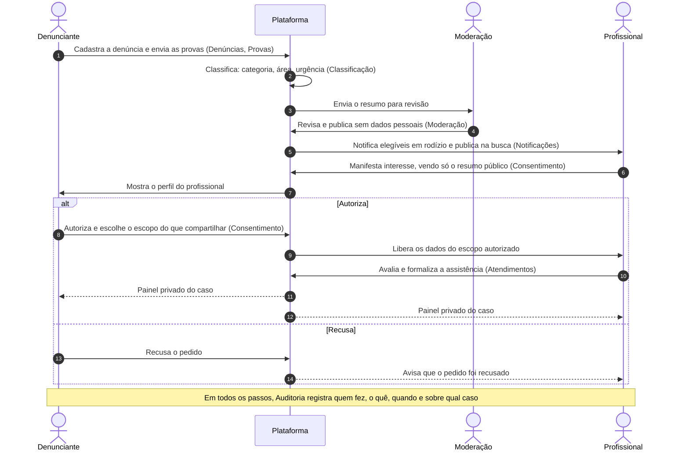

# 2 · Fluxo do caso entre os atores

Os 8 passos do processo de assistência. Entre parênteses, o módulo responsável.

```mermaid
sequenceDiagram
    autonumber
    actor D as Denunciante
    participant P as Plataforma
    actor M as Moderação
    actor A as Profissional

    D->>P: Cadastra a denúncia e envia as provas (Denúncias, Provas)
    P->>P: Classifica: categoria, área, urgência (Classificação)
    P->>M: Envia o resumo para revisão
    M->>P: Revisa e publica sem dados pessoais (Moderação)
    P->>A: Notifica elegíveis em rodízio e publica na busca (Notificações)
    A->>P: Manifesta interesse, vendo só o resumo público (Consentimento)
    P->>D: Mostra o perfil do profissional
    alt Autoriza
        D->>P: Autoriza e escolhe o escopo do que compartilhar (Consentimento)
        P->>A: Libera os dados do escopo autorizado
        A->>P: Avalia e formaliza a assistência (Atendimentos)
        P-->>D: Painel privado do caso
        P-->>A: Painel privado do caso
    else Recusa
        D->>P: Recusa o pedido
        P-->>A: Avisa que o pedido foi recusado
    end

    Note over D,A: Em todos os passos, Auditoria registra quem fez, o quê, quando e sobre qual caso
```
